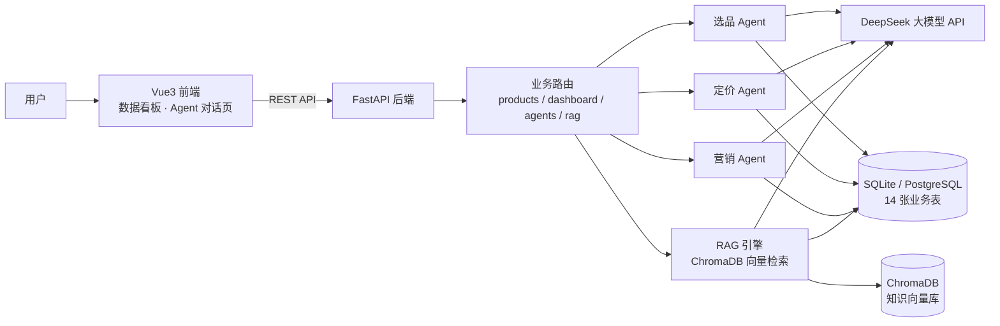

# 电商运营 Agent（E-commerce Operations Agent）

面向中小电商的 **多角色 AI 运营助手**：选品 / 定价 / 营销 三大 Agent + RAG 知识库 + 数据看板，基于 **UCI Online Retail 真实交易数据**（54 万条）构建。

> **个人独立项目**（产品定义 · 架构设计 · 数据策略 · 评测闭环 全流程负责人）
> 2026.06 – 2026.09 完成 v0.1 → v0.6 六轮迭代，借助 AI Coding 工具辅助编程实现，可本地一键启动演示。
> 完整产品决策记录见 [`docs/产品决策文档.md`](docs/产品决策文档.md)，RAG 评测报告见 [`docs/rag_evaluation.md`](docs/rag_evaluation.md)。

## 项目简介

电商运营长期依赖人工经验，选品、定价、营销决策缺乏数据支撑、效率低、难以沉淀方法。本项目用 **多角色 Agent（选品/定价/营销/知识问答）+ RAG 检索增强 + 真实交易数据** 构建一个可对话的 AI 运营助手，把运营决策从"拍脑袋"变为"数据 + 模型"驱动：

| 功能模块 | 说明 |
|---|---|
| 选品 Agent | 基于销量/毛利/竞争/市场四维真实数据生成选品建议，支持审批生效、写入决策记录 |
| 定价 Agent | 结合成本与同分类价格带输出定价建议，审批后自动更新售价并写入价格历史，可追溯 |
| 营销 Agent | 生成营销策划方案与推广文案 |
| 知识问答（RAG） | 基于运营知识库与商品数据检索增强回答，带来源标注，附 30 条评测集与迭代指标 |
| 数据看板 | 指标卡 + ECharts 图表可视化运营数据（前端 Vue3） |

## 技术架构



## 技术栈

**FastAPI · LangChain · DeepSeek · ChromaDB（RAG）· SQLAlchemy · Vue3 · Element Plus · ECharts · Docker**

## 快速开始

```powershell
# 后端（端口 8001）
$env:USERPROFILE = 'D:\ecommerce-agent\.home'
cd /d D:\ecommerce-agent
backend\.venv\Scripts\python.exe -m uvicorn backend.main:app --reload --reload-dir D:\ecommerce-agent --port 8001

# 前端（端口 5173，需后端已启动）
cd /d D:\ecommerce-agent\frontend
D:\nodejs\npm.cmd run dev
```

- 前端地址：http://localhost:5173
- 后端 API 文档：http://127.0.0.1:8001/docs
- 运行数据：300 真实商品（UCI Online Retail）/ 9 分类 / 900 竞品价 / 3 活动 / 4 知识库文档（口径见"数据来源"章节）

---

## 目录结构

```
ecommerce-agent/
├── backend/            # 后端（FastAPI + LangChain + SQLAlchemy）
│   ├── main.py         # 入口
│   ├── config.py       # 配置（.env 读取）
│   ├── database.py     # 异步 SQLAlchemy
│   ├── models/         # SQLAlchemy 模型（14 张表）
│   ├── agents/         # Agent（base 基类 + selection 选品 / pricing 定价 / marketing 营销）
│   ├── rag/            # RAG 引擎（ChromaDB 检索 + DeepSeek 生成）
│   ├── api/            # 路由（products / dashboard / agents / rag）
│   ├── import_uci.py   # UCI 真实数据导入脚本（真实/派生/估算口径透明标注）
│   └── eval_rag.py     # RAG 评测脚本（30 条问答对，输出指标报告）
├── docs/               # 产品决策文档（PAR）· RAG 评测报告与明细
├── frontend/           # 前端（Vue3 + Element Plus + ECharts）
├── sql/                # 数据库脚本（PostgreSQL / SQLite / 种子数据）
├── data/               # 本地数据（SQLite / ChromaDB / UCI 原始数据集）
├── tests/
└── requirements.txt
```

## 运行方法（后端）

```powershell
# 启动（端口 8001；USERPROFILE 指向 D 盘，让向量模型缓存落在 D 盘项目内）
$env:USERPROFILE = 'D:\ecommerce-agent\.home'
cd /d D:\ecommerce-agent
backend\.venv\Scripts\python.exe -m uvicorn backend.main:app --reload --reload-dir D:\ecommerce-agent --port 8001
```

- API 文档：http://127.0.0.1:8001/docs
- 健康检查：http://127.0.0.1:8001/health
- 产品列表：http://127.0.0.1:8001/api/products
- 看板汇总：http://127.0.0.1:8001/api/dashboard/summary
- 选品记录：http://127.0.0.1:8001/api/agents/selection
- Agent 任务：http://127.0.0.1:8001/api/agents/tasks
- 知识库问答：POST /api/rag/query（body: {"question": "..."}）

## Agent 接口

```bash
# 选品分析（真实调用 DeepSeek，结果写入 product_selections）
POST /api/agents/selection/analyze
# body: {"category": "连衣裙", "params": {"user_id": 2}}

# 审批选品建议
POST /api/agents/selection/{id}/approve
```

## Agent 接口（定价 / 营销）

```bash
# 定价分析（真实调用 DeepSeek，结果写入 price_suggestions）
POST /api/agents/pricing/analyze
# body: {"product_id": 1, "params": {"user_id": 2}}

# 定价建议列表（可按 status 过滤）
GET /api/agents/pricing?status=pending

# 审批定价（更新产品售价 + 写入 price_history）
POST /api/agents/pricing/{id}/approve

# 驳回定价建议
POST /api/agents/pricing/{id}/reject

# 营销策划（生成方案 + 文案，更新活动信息）
POST /api/agents/marketing/analyze
# body: {"campaign_id": 1, "params": {"user_id": 2}}

# 活动列表 / 详情（含 AI 文案）
GET /api/agents/marketing/campaigns
GET /api/agents/marketing/campaigns/{id}
```

## RAG 接口

```bash
# 知识库问答（向量检索 + DeepSeek 结合资料回答，带来源标注）
POST /api/rag/query
# body: {"question": "如何做好电商选品？", "top_k": 4}

# 重建向量索引（知识库文档 + 产品数据，启动时自动执行）
POST /api/rag/rebuild

# 知识库文档列表
GET /api/rag/documents
```

> 向量模型：Chroma 内置 ONNX MiniLM（384 维，模型缓存位于 `D:\ecommerce-agent\.home\.cache\chroma`）。
> 中文语义检索如需更强召回，可后续换装 BGE 中文向量模型。

## Docker 部署（生产环境）

项目提供完整 Docker 部署包（PostgreSQL 15 + 后端 + 前端 Nginx），在有 Docker 的机器上一键启动：

```bash
# 在项目根目录（D:\ecommerce-agent）执行；OPENAI_API_KEY 自动从根 .env 读取
docker compose up -d --build
```

- 前端：http://localhost:8080 （Nginx 托管，/api 自动反代到后端）
- 后端 API 文档：http://localhost:8000/docs
- 数据库：PostgreSQL 15（数据卷 pgdata 持久化）
- 初始化：后端启动时自动建表（SQLAlchemy create_all）+ 幂等导入种子数据（SEED_ON_START）
- 向量库：./data/chromadb 挂载持久化

> ⚠️ 说明：本机因"软件只装 D 盘"约束未安装 Docker Desktop，compose 已通过 YAML 结构校验与容器环境变量覆盖模拟（DATABASE_URL/API Key 均验证），未在本机端到端执行；在任何装有 Docker 的机器上运行即可。

## 数据来源与口径

项目运行数据来自 **UCI Online Retail 公开数据集**（54 万条真实交易，英国在线零售 2010-12 ~ 2011-12），
清洗聚合后按销售额取 Top 300 商品入库。**所有字段口径透明标注，不编造数据**：

| 字段 | 口径 |
|---|---|
| 商品名 / SKU / 价格 / 月销量 / 市场 | 真实（来自数据集，价格取中位价，月销 = 总销量 ÷ 覆盖月数） |
| 分类 | 派生（商品名关键词规则归类，9 类） |
| 竞品价 | 派生（同分类价格带 P25/P50/P75） |
| 成本 / 库存 / 评分 | 估算（成本=售价×0.6 行业口径；库存=月销×15 天；评分=默认 4.5） |
| 用户评价 | 缺失（数据集不含评价字段，reviews 表为空，如实标注） |
| 用户 / 活动 / 知识库 | 业务配置（系统账号与运营模板） |

原始数据集：`data/raw_uci/Online Retail.xlsx`（UCI 官网可下载验证）。

重灌数据（重置数据库并导入 300 真实商品）：

```bash
python -m backend.import_uci   # 在 D:\ecommerce-agent 下执行
```

## 效果评测（RAG）

用 30 条真实业务问答（选品/定价/营销/数据分析/商品查询）做评测集，驱动检索策略两轮迭代：

| 指标 | V1 初版 | V3 加权版 |
|---|---|---|
| 检索命中率 hit@4 | 66.7% | **80.0%** |
| 答案忠实度 | 90.0% | 90.0% |
| 回答成功率 | 100% | 100% |
| 平均延迟 | 5675 ms | 5725 ms |

- 迭代过程：V1 商品文档挤占检索名额 → V2 分类型混合检索（未提升）→ V3 来源加权（知识库 ×1.25）显著提升。
- 剩余失败为商品精确查询类（聚合问题应路由数据库查询，属 RAG 能力边界，已在产品决策文档中标注为下一迭代项）。
- 评测明细（每条含来源/延迟/答案摘要，可逐条复核）：`docs/rag_evaluation.jsonl`。
- 产品决策完整记录（PAR 模型 + 6 个面试追问答案）：[`docs/产品决策文档.md`](docs/产品决策文档.md)。

## 关键配置（.env）

- `OPENAI_API_KEY`：DeepSeek Key（OpenAI 兼容，模型 `deepseek-flash`）
- `DATABASE_URL`：本地 SQLite；部署时改 PostgreSQL
- `CORS_ORIGINS`：允许 Vite 前端（localhost:5173）

## 说明

- SQLite 本地版已建 **14 张表**（用户/产品/竞品价格/评价/选品/活动/知识库/Agent 任务等）。
- 文档原代码存在版本过时、JS 笔误等坑，落地时已按新版 API（langchain 1.4 / langchain-openai 1.6）修正。
